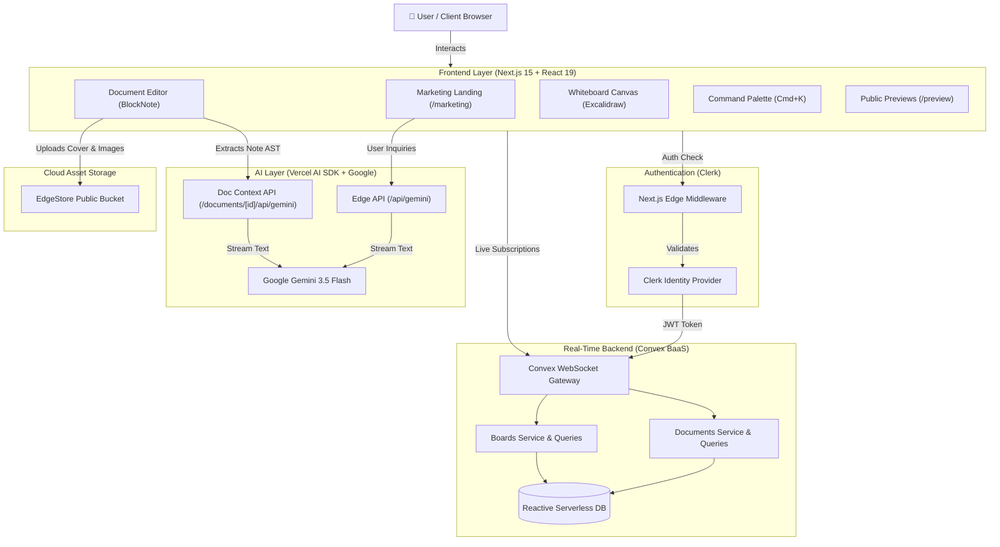
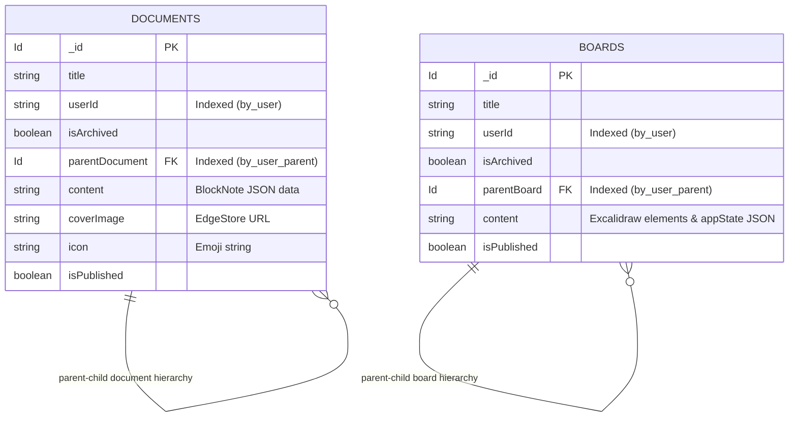

# ✍️ SyncPen – Where Sync Meets Pen

<div align="center">

  

  ### The Modern All-in-One Collaborative Productivity Workspace
  **Notion-Style Block Notes • Excalidraw Infinite Whiteboard • Page-Aware Gemini AI • Real-Time Cloud Sync**

  <p align="center">
    <a href="https://sync-pen-six.vercel.app/"><strong>🌐 Explore the Live Demo »</strong></a>
  </p>

  [](https://nextjs.org/)
  [](https://react.dev/)
  [](https://www.typescriptlang.org/)
  [](https://tailwindcss.com/)
  [](https://www.convex.dev/)
  [](https://clerk.com/)
  [](https://ai.google.dev/)
  [](https://excalidraw.com/)
  [](https://edgestore.dev/)
  [](https://vercel.com/)

</div>

---

## 📖 Table of Contents

- [Overview](#-overview)
- [Key Features](#-key-features)
  - [1. Notion-Style Document Editor](#1--notion-style-document-editor-blocknote)
  - [2. Infinite Whiteboard Canvas](#2--infinite-whiteboard-canvas-excalidraw)
  - [3. Dual-Layer AI Assistant](#3--dual-layer-ai-assistant-google-gemini-35-flash)
  - [4. Real-Time Reactive Backend](#4--real-time-reactive-backend-convex)
  - [5. Authentication & Security](#5--authentication--security-clerk)
  - [6. Media & Asset Storage](#6--media--asset-storage-edgestore)
  - [7. Polished UI/UX & Design](#7--polished-uiux--modern-design)
- [System Architecture](#️-system-architecture)
- [Tech Stack Breakdown](#-tech-stack-breakdown)
- [Convex Database Schema](#-convex-database-schema)
- [Project Directory Structure](#-project-directory-structure)
- [Quick Start & Local Setup](#-quick-start--local-setup)
  - [Prerequisites](#prerequisites)
  - [Step-by-Step Installation](#step-by-step-installation)
- [Environment Variables Guide](#-environment-variables-guide)
- [Deployment](#-deployment-vercel--convex)
- [Available Scripts](#-available-scripts)
- [Contributing](#-contributing)
- [Author & Acknowledgments](#-author--acknowledgments)

---

## 🌟 Overview

**SyncPen** bridges the gap between structured linear documentation and unstructured visual ideation. Instead of switching between disconnected apps for note-taking, wireframing, and AI brainstorming, SyncPen integrates them into a single, cohesive, lightning-fast workspace:

- **Plan & Document**: Write structured, beautiful documents with a rich block editor featuring slash commands, emoji icons, tables, and cover images.
- **Draw & Sketch**: Brainstorm on an infinite Excalidraw whiteboard canvas with real-time viewport zoom and coordinate persistence.
- **Ask AI in Context**: Leverage Google Gemini 3.5 Flash to converse with your documents. The assistant automatically parses your active note's block tree to summarize, explain, expand, and draft content with zero manual copy-pasting.
- **Real-Time Reactive Cloud**: Powered by Convex, every keystroke, canvas vector, and document status updates across all connected clients instantly with zero HTTP polling.

---

## ✨ Key Features

### 1. 📝 Notion-Style Document Editor (BlockNote)
- **Block-Based WYSIWYG**: Built on `@blocknote/react` and `@blocknote/mantine` with support for headings (H1–H3), bullet/numbered lists, checkboxes, blockquotes, code blocks, tables, and dividers.
- **Slash Commands (`/`) & Inline Toolbar**: Quickly insert blocks, format text styling (bold, italic, strikethrough, inline code), or embed links.
- **Infinite Nested Hierarchy**: Organize notes within parent notes indefinitely with recursive tree views.
- **Emoji Picker**: Personalize documents with searchable emojis via `emoji-picker-react`.
- **Cover Images**: Upload, replace, and remove high-resolution header images hosted seamlessly on EdgeStore.
- **Soft Deletion & Trash Bin**: Safely archive notes with a cascading soft-delete mechanism that preserves hierarchy, accompanied by an instant trash recovery or permanent wipe option.
- **Public Publishing & Sharing**: Generate instant read-only public web URLs (`/notesPreview/[documentId]`) to share notes with collaborators or clients.

### 2. 🎨 Infinite Whiteboard Canvas (Excalidraw)
- **Fluid Infinite Canvas**: Powered by `@excalidraw/excalidraw` (v0.18) with client-side dynamic SSR-safe rendering.
- **30+ Vector Drawing Tools**: Rectangles, ellipses, diamonds, arrows, connectors, freehand drawings, text annotations, and erasers.
- **Viewport & Element State Persistence**: Automatically serializes element structures and canvas viewports (`scrollX`, `scrollY`, `zoom`) to Convex upon every change.
- **Hierarchical Board Folders**: Nest whiteboards hierarchically inside parent boards just like documents.
- **Canvas Management**: Instant canvas clearing, custom background color selection, and exporting diagrams as PNG or SVG.
- **Public Board Sharing**: Publish boards to shareable public links (`/boardsPreview/[boardId]`).

### 3. 🤖 Dual-Layer AI Assistant (Google Gemini 3.5 Flash)
- **Page-Aware In-Document Assistant (`/documents/[documentId]`)**:
  - Automatically traverses and parses the BlockNote abstract syntax tree (AST) via `extractTextFromDocument`.
  - Extracts text from paragraphs, headers, tables, and nested blocks.
  - Injects live page content into Google Gemini 3.5 Flash via Edge API routes, allowing users to ask questions, request summaries, extract action items, or generate new sections based specifically on their current document.
- **Landing Page Support Assistant**:
  - Interactive chatbot on the marketing landing page built with Vercel AI SDK (`useChat` & `streamText`).
  - Streams real-time answers to user questions about SyncPen's features, capabilities, and productivity workflows.

### 4. ⚡ Real-Time Reactive Backend (Convex)
- **Live Reactive Subscriptions**: Convex replaces traditional REST/GraphQL polling with persistent real-time WebSocket subscriptions (`useQuery`, `useMutation`).
- **Zero Configuration DB**: Fully typed TypeScript schema with server-side validation using `convex/values`.
- **Optimized Compound Indexes**: Database queries indexed by `by_user` and `by_user_parent` for instant sub-millisecond retrieval.
- **Recursive Cascading Operations**:
  - Archiving a parent document/board recursively archives all nested descendants.
  - Restoring a nested item automatically restores all its ancestors to avoid orphaned nodes.

### 5. 🔒 Authentication & Security (Clerk)
- Seamless authentication with `@clerk/nextjs` supporting social logins, email/password, and session management.
- Convex identity verification via Clerk JWT integration (`auth.config.ts`), ensuring database mutations and queries strictly match the authenticated user's `userId`.
- Route protection powered by Next.js edge `middleware.ts`.

### 6. ☁️ Media & Asset Storage (EdgeStore)
- Fast, secure file uploading for document covers and embedded note assets via `@edgestore/server` and `@edgestore/react`.
- Integrated with Next.js image optimization (`next.config.ts` remote patterns for `files.edgestore.dev`).
- Automatic lifecycle management and cleanup before deletion.

### 7. 🌲 Polished UI/UX & Modern Design
- **Command Palette (`Cmd+K` / `Ctrl+K`)**: Rapid global search modal (`cmdk`) to jump to any note or whiteboard instantaneously.
- **Collapsible & Resizable Sidebar**: Draggable sidebar width handler with collapse/expand toggles and smooth responsive drawer behavior on mobile.
- **Dark & Light Mode**: Smooth theme toggling via `next-themes` with tailored color palettes for both editor and canvas views.
- **3D Card & Micro-Animations**: Interactive 3D perspective card effects and landing splash screen powered by Framer Motion.
- **Interactive Feedback**: Responsive toast alerts using `sonner`.

---

## 🏗️ System Architecture



---

## 🛠️ Tech Stack Breakdown

| Category | Technology | Version | Purpose |
| :--- | :--- | :--- | :--- |
| **Framework** | [Next.js](https://nextjs.org/) | `15.5` | App Router, Turbopack, Edge runtime API handlers, SSR & dynamic imports |
| **Language** | [TypeScript](https://www.typescriptlang.org/) | `^5` | Strict type safety across frontend and backend data models |
| **UI Library** | [React](https://react.dev/) | `19.3` | Declarative component UI engine |
| **Styling** | [Tailwind CSS](https://tailwindcss.com/) | `^4` | Utility-first responsive styling with modern PostCSS pipeline |
| **Components** | [ShadCN / Radix UI](https://ui.shadcn.com/) | Latest | Accessible headless UI primitives (dialogs, popovers, dropdowns, scroll-area) |
| **Rich Text Editor** | [BlockNote](https://www.blocknotejs.org/) | `0.26.0` | Notion-like block-based WYSIWYG editor with formatting toolbars |
| **Infinite Canvas** | [Excalidraw](https://excalidraw.com/) | `0.18.0` | Virtual whiteboard with vector shapes, freehand drawing, and diagramming |
| **Real-Time Backend** | [Convex](https://www.convex.dev/) | `1.20.0` | Serverless reactive database, WebSocket subscriptions, and transactions |
| **Authentication** | [Clerk](https://clerk.com/) | `6.12.5` | User authentication, identity management, and JWT session handling |
| **AI Integration** | [Vercel AI SDK](https://sdk.vercel.ai/) | `4.2.10` | Stream handling, conversation state management (`useChat`, `streamText`) |
| **LLM Provider** | [Google Gemini](https://ai.google.dev/) | `@ai-sdk/google 1.2` | Contextual question answering, document summarization (`gemini-3.5-flash`, overridable via `GEMINI_MODEL`) |
| **File Storage** | [EdgeStore](https://edgestore.dev/) | `0.3.3` | Optimized cloud storage bucket for cover images and document attachments |
| **Motion & 3D** | [Framer Motion](https://www.framer.com/motion/) | `12.6.3` | Smooth layout transitions, splash screens, and 3D card perspective tilt |
| **3D Graphics** | [Spline](https://spline.design/) | `4.0.0` | Embedded interactive 3D WebGL scene rendering |
| **Theme Engine** | [next-themes](https://github.com/pacocoursey/next-themes) | `0.4.6` | Light and dark mode support with zero layout flicker |
| **Icons & Emojis** | [Lucide React](https://lucide.dev/) / `emoji-picker-react` | `0.482.0` | Crisp UI icons and searchable emoji selector |
| **Notifications** | [Sonner](https://sonner.emilkowal.ski/) | `2.0.1` | Sleek, customizable toast notifications |

---

## 🗄️ Convex Database Schema

SyncPen leverages Convex's document database with compound indexing to guarantee ultra-fast querying and relational integrity:



### Database Schema Highlights (`convex/schema.ts`):
- **`documents` Table**:
  - `userId`: Associates notes directly to the authenticated Clerk user.
  - `parentDocument`: Enables infinite nesting of child notes within parent notes.
  - `content`: Serialized BlockNote blocks including headers, text, tables, and embeds.
  - `isArchived`: Controls soft-delete state for the trash bin.
  - `isPublished`: Enables public read-only web view generation.
  - **Indexes**: `by_user (userId)` and `by_user_parent (userId, parentDocument)`.
- **`boards` Table**:
  - `parentBoard`: Enables hierarchical nesting of whiteboard canvases.
  - `content`: Serialized Excalidraw element coordinates, drawing strokes, zoom level, and scroll offsets.
  - **Indexes**: `by_user (userId)` and `by_user_parent (userId, parentBoard)`.

---

## 📂 Project Directory Structure

```text
SyncPen-main/
├── app/                                        # Next.js 15 App Router
│   ├── (main)/                                 # Authenticated workspace application
│   │   ├── (boards)/                           # Excalidraw Whiteboards
│   │   │   ├── _components/                    # Navigation, toolbar, menu, trash-box
│   │   │   ├── boards/                         # Board routes
│   │   │   │   ├── [boardId]/page.tsx          # Interactive Excalidraw board canvas
│   │   │   │   └── page.tsx                    # Board dashboard empty state
│   │   │   └── layout.tsx                      # Boards layout wrapper
│   │   └── (notes)/                            # Notion-Style Document Notes
│   │       ├── _components/                    # Note navigation, item list, trash-box, banner
│   │       ├── documents/                      # Document routes
│   │       │   ├── [documentId]/               # Active document view
│   │       │   │   ├── _components/            # Page-aware in-document chatBox
│   │       │   │   ├── api/gemini/route.ts     # Document-aware Gemini endpoint
│   │       │   │   └── page.tsx                # BlockNote editor page with AST text parser
│   │       │   └── page.tsx                    # Notes welcome / create note page
│   │       └── layout.tsx                      # Notes layout wrapper
│   ├── (marketing)/                            # Public landing page
│   │   ├── _components/                        # Hero, 3D cards, navbar, footer, chatBox, splash
│   │   ├── layout.tsx                          # Marketing layout
│   │   └── page.tsx                            # Landing page
│   ├── (public)/                               # Public shareable preview routes
│   │   └── (routes)/
│   │       ├── boardsPreview/[boardId]/        # Read-only public board viewer
│   │       └── notesPreview/[documentId]/      # Read-only public note viewer
│   ├── api/                                    # Global API routes
│   │   ├── edgestore/[...edgestore]/route.ts   # EdgeStore file upload handler
│   │   └── gemini/route.ts                     # Landing page AI assistant streaming endpoint
│   ├── error.tsx                               # Global error boundary
│   ├── globals.css                             # Tailwind CSS v4 design tokens
│   └── layout.tsx                              # Root layout & providers
├── components/                                 # Reusable UI & Core Components
│   ├── modals/                                 # Confirm modal, settings, cover-image dialog
│   ├── providers/                              # Convex, Clerk, Theme, and Modal providers
│   ├── ui/                                     # ShadCN UI & 3D Card primitives
│   ├── appearences.tsx                         # Appearance settings & theme selector
│   ├── canvas.tsx                              # Excalidraw wrapper component with auto-save
│   ├── cover-notes.tsx                         # Note cover image component
│   ├── editor-notes.tsx                        # BlockNote Mantine editor component
│   ├── icon-picker.tsx                         # Emoji picker popover
│   ├── logo.tsx                                # SyncPen logo
│   ├── mode-toggle.tsx                         # Dark / Light theme switch
│   ├── search-boards-command.tsx               # cmdk search palette for boards
│   ├── search-notes-command.tsx                # cmdk search palette for documents
│   └── toolbar-notes.tsx                       # Note title, icon, and cover action toolbar
├── convex/                                     # Convex Real-Time Backend
│   ├── _generated/                             # Convex generated server & data types
│   ├── auth.config.ts                          # Clerk JWT provider configuration
│   ├── boards.ts                               # Board queries, mutations, recursive archive
│   ├── documents.ts                            # Document queries, mutations, recursive archive
│   └── schema.ts                               # Database schema definitions & compound indexes
├── hooks/                                      # Custom React Hooks
│   ├── use-cover-image.tsx                     # Zustand modal store for cover upload
│   ├── use-origin.tsx                          # Safe SSR window origin resolution
│   ├── use-scroll-top.tsx                      # Window scroll listener hook
│   ├── use-search.tsx                          # Zustand search modal state
│   └── use-settings.tsx                        # Zustand settings modal state
├── lib/                                        # Utilities & Configs
│   ├── chatDataHome.ts                         # System prompt & initial AI assistant knowledge
│   ├── edgestore.ts                            # EdgeStore client provider
│   └── utils.ts                                # cn (clsx + tailwind-merge) utility
├── public/                                     # Static illustrations, logos, SVG badges
├── middleware.ts                               # Clerk route matcher & auth middleware
├── next.config.ts                              # Next.js remote patterns & edge config
├── package.json                                # Project dependencies and scripts
└── tsconfig.json                               # TypeScript compiler configuration
```

---

## 🚀 Quick Start & Local Setup

### Prerequisites
Before running SyncPen locally, ensure you have the following installed:
- [Node.js](https://nodejs.org/) (`v18.17` or later, `v20+` recommended)
- [npm](https://www.npmjs.com/) (or `pnpm` / `yarn`)
- Accounts on:
  - [Convex](https://dashboard.convex.dev) (Real-time backend)
  - [Clerk](https://dashboard.clerk.com) (Authentication)
  - [EdgeStore](https://dashboard.edgestore.dev) (Asset storage)
  - [Google AI Studio](https://aistudio.google.com/) (Gemini API key)

---

### Step-by-Step Installation

#### 1. Clone the Repository
```bash
git clone https://github.com/mainak569/SyncPen.git
cd SyncPen
```

#### 2. Install Dependencies
```bash
npm install
```

#### 3. Configure Environment Variables
Copy the provided `.env.example` file to create your `.env.local`:
```bash
cp .env.example .env.local
```
Open `.env.local` in your editor and enter your credentials (see [Environment Variables Guide](#-environment-variables-guide)).

#### 4. Initialize Convex
Run the Convex development command in a separate terminal:
```bash
npx convex dev
```
- If prompted, log into Convex via your browser and select or create a new project.
- This will automatically generate your `CONVEX_DEPLOYMENT` and `NEXT_PUBLIC_CONVEX_URL` keys and populate the `convex/_generated` types.

#### 5. Configure Clerk & Convex Integration
To enable Convex to verify Clerk user identities:
1. In the [Clerk Dashboard](https://dashboard.clerk.com), navigate to **JWT Templates** > **New Template**.
2. Select the **Convex** template.
3. Keep the template name as `convex` and save.
4. Copy the **Issuer URL** from Clerk.
5. Set it on your Convex deployment (this is Convex's environment, not `.env.local`):
   ```bash
   npx convex env set CLERK_JWT_ISSUER_DOMAIN https://your-clerk-issuer-domain.clerk.accounts.dev/
   ```
   `convex dev` refuses to push functions until this is set.

#### 6. Start the Development Server
```bash
npm run dev
```

Open your browser and navigate to:
```
http://localhost:3000
```

---

## 🔐 Environment Variables Guide

| Variable | Description | Where to Obtain |
| :--- | :--- | :--- |
| `CONVEX_DEPLOYMENT` | Deployment identifier for the Convex serverless backend | Generated via `npx convex dev` or [Convex Dashboard](https://dashboard.convex.dev) |
| `NEXT_PUBLIC_CONVEX_URL` | Public cloud URL for real-time WebSocket client connection | [Convex Project Dashboard](https://dashboard.convex.dev) |
| `NEXT_PUBLIC_CLERK_PUBLISHABLE_KEY` | Public publishable key for Clerk client-side authentication | [Clerk Dashboard](https://dashboard.clerk.com) > API Keys |
| `CLERK_SECRET_KEY` | Secret key for Clerk server-side middleware and authentication | [Clerk Dashboard](https://dashboard.clerk.com) > API Keys |
| `EDGE_STORE_ACCESS_KEY` | Access key for EdgeStore public file buckets | [EdgeStore Dashboard](https://dashboard.edgestore.dev) |
| `EDGE_STORE_SECRET_KEY` | Secret key for EdgeStore file authorization | [EdgeStore Dashboard](https://dashboard.edgestore.dev) |
| `GOOGLE_API_KEY` | Google Gemini API key for the AI assistant | [Google AI Studio](https://aistudio.google.com/) |
| `GEMINI_MODEL` | *Optional.* Gemini model id; defaults to `gemini-3.5-flash` | [Gemini models](https://ai.google.dev/gemini-api/docs/models) |
| `CLERK_JWT_ISSUER_DOMAIN` | Clerk issuer URL. Set on the **Convex deployment** (not in `.env`) | Clerk Dashboard > JWT Templates > Convex > Issuer |

---

## 🚀 Deployment (Vercel + Convex)

The Next.js build does **not** deploy the Convex backend on its own. If the two drift apart, pages call functions the backend doesn't have and crash.

1. **Production Convex:** set the issuer for your *production* Clerk instance on the prod deployment:
   ```bash
   npx convex env set --prod CLERK_JWT_ISSUER_DOMAIN https://clerk.your-domain.com/
   ```
2. **Vercel environment variables:** everything in the table above, with production values. Also add `CONVEX_DEPLOY_KEY` (Convex Dashboard → Settings → Deploy Keys → production). Use Clerk **production** keys (`pk_live_…` / `sk_live_…`); development keys are rate-limited.
3. **Vercel build command** so each deploy ships the backend and frontend together:
   ```bash
   npx convex deploy --cmd 'npm run build'
   ```
4. Redeploy.

---

## 📜 Available Scripts

| Command | Description |
| :--- | :--- |
| `npm run dev` | Runs the Next.js development server with Turbopack fast refresh on `http://localhost:3000` |
| `npx convex dev` | Starts the Convex cloud database synchronization and schema validator |
| `npm run build` | Compiles and builds the production Next.js bundle |
| `npm run start` | Starts the production server |
| `npm run lint` | Runs ESLint to identify code quality and styling errors |

---

## 🤝 Contributing

Contributions, feature requests, and bug reports are welcome!
To contribute:
1. Fork the project.
2. Create your feature branch (`git checkout -b feature/AmazingFeature`).
3. Commit your changes (`git commit -m "Add some AmazingFeature"`).
4. Push to the branch (`git push origin feature/AmazingFeature`).
5. Open a Pull Request.

---

## 🙋‍♂️ Author & Acknowledgments

Crafted with ❤️ by **Mainak Das**

- **GitHub**: [@mainak569](https://github.com/mainak569)
- **LinkedIn**: [Mainak Das](https://www.linkedin.com/in/mainak-das-93b787287/)
- **Project Repository**: [https://github.com/mainak569/SyncPen](https://github.com/mainak569/SyncPen)
- **Live Application**: [https://sync-pen-six.vercel.app/](https://sync-pen-six.vercel.app/)

---

<div align="center">
  <sub>Built with modern web technologies: Next.js 15, Convex, Excalidraw, BlockNote, and Google Gemini.</sub>
</div>
